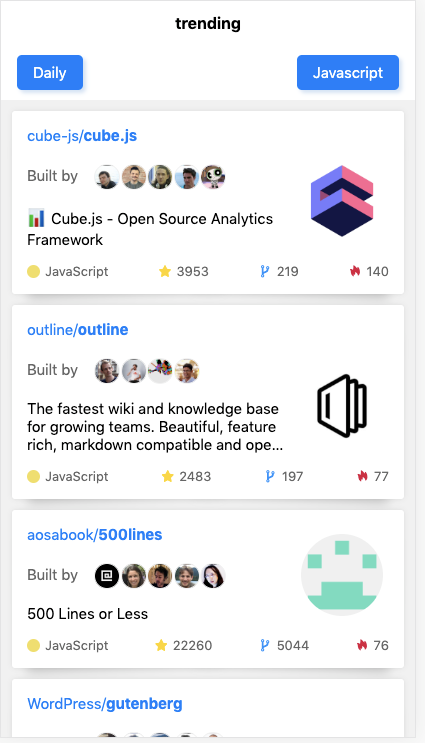
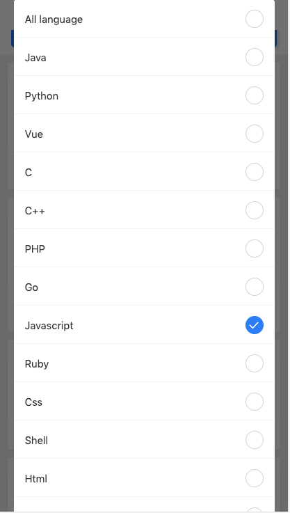
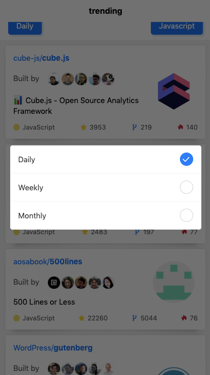

## Github4All

- [English version](./README.md)

>没错, 这就是又一个 GitHub trending,本来想写成一个小程序的。

>当微信小程序支持web-view时，我觉得时机到了，后来才注意到原来只支持企业用户。。。

>现在只能等着了，先上线h5版

   

 

## 线上

> 需要打开Chrome开发者模式并使用手机模式预览，或者用手机浏览
* [Click ME~](https://www.telami.cn/trending/)

## 支持 Github4All

如果你喜欢github4all的话, 可以给我点个 ⭐ [GitHub](https://github.com/telami/github4all), 或者推荐给朋友一下。

## 感谢

* [uniapp](https://uniapp.dcloud.io/): 是一个使用 Vue.js 开发所有前端应用的框架，开发者编写一套代码，可编译到iOS、Android、H5、以及各种小程序等多个平台。
* [huchenme/github-trending-api](https://github.com/huchenme/github-trending-api): Api提供者

## 协议

[MIT](https://github.com/telami/github4all/blob/master/LICENSE).
